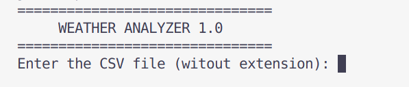

# Weather Analyzer

*Start screen of the Weather Analyzer program*

**Weather Analyzer** is a Java program that reads, processes, and analyzes weather station data from a CSV file, and generates detailed summary reports in `.txt`, `.csv`, and terminal output formats.

---

## Features

  - Reads historical weather data from a CSV file.
  - Computes summary statistics for:
    - Temperature (max, min, average)
    - Humidity (max, min)
    - Pressure (max, min)
    - Wind Speed (max, min)
  - Detects and displays temperature trends (longest increasing/decreasing streaks).
  - Output reports to:
    - The console
    - A `.txt` file
    - A `.csv` file
  
  
  *Summary with visual bar charts in the terminal*
  
---

## How it works

The core of the application relies on `DataReader.java`, which handles CSV parsing and validation. It maps weather data columns to the internal model, cleans input values, and prepares a structured list for analysis.

*Available options after loading a valid CSV file*

---

## Input File Format

When prompted, simply enter the **file name** (without the `.csv` extension). For example, if your file is named `tucson_last7days.csv`, just type:

tucson_last7days

*Prompt asking for the file name without the .csv extension*

---

## CSV Requirements

For correct execution, your CSV file must meet the following conditions:

  - Must contain **all required headers**:
    - `datetime` -> timestamp
    - `temp` -> temperature
    - `humidity` -> humidity
    - `sealevelpressure` -> pressure
    - `windspeed` -> wind speed

- Every data cell must be either:
  - A valid numeric value
  - Or one of the accepted placeholders: `"NA"`, `"na"`, `"-"`, or `" "` (which are automatically interpreted as `0.0`)

**Note:** The analyzer ignores all other columns that are not in the required set above.

---

# Recommended Data Source

For best compatibility, I recommend downloading your CSV from:

--> https://www.visualcrossing.com/

Their exports use the header names expected by the program, making the integration seamless.

--- 

## How to Run

Make sure you have `make` and Java (JDK 8 or higher) installed.

### 1. Compile the project

make compile

### 2. Run the Program

make run

Or simply:

make ( which will compile and then run the apllication in one step )

### 3. Clean Build Files

make clean

---

## Report Examples

### Text Report 

*Example of the generated `.txt` report*

### CSV Report

*CSV-formatted metrics opened in spreadsheet software*